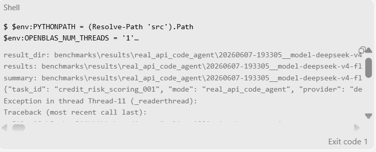

# TableCodeAgent v0.0.4 修复报告

日期：2026-06-08  
仓库：`D:\桌面\TableCodeAgent`  
口径：真实 LLM Agent benchmark 必须采用 `no_helper`，内部 workflow helper 仅用于单元/集成测试。

## 本轮目标与范围

本轮按用户确认方案完成 v0.0.4 实质开发，目标是修复 v0.0.3 审阅中暴露的 helper-assisted benchmark、Agent JSON 输出契约、runner 失败分类、结果可观测性、跨平台环境说明和信贷风控业务复杂度问题。

本轮不提交代码，不读取、打印或复制真实 API key；真实 API benchmark 均使用 `configs/api/local/deepseek.env`。最初按节省额度要求只运行一次；随后按用户要求，在 sandbox UTF-8 修复和公开契约补齐过程中追加多次复测，最终 rerun7 通过。

## 用户选择的方案

1. Windows/Linux 环境：选择“Windows 与 Linux 各自本地虚拟环境 + README 对等命令 + 最小 setup 脚本”。  
   交付 [requirements-dev.txt](../../requirements-dev.txt)、[scripts/setup_windows.ps1](../../scripts/setup_windows.ps1)、[scripts/setup_linux.sh](../../scripts/setup_linux.sh)，并在 [README.md](../../README.md) 保留手动命令。

2. Agent JSON 输出规范：选择 Pydantic answer model。  
   交付 [answer_models.py](../../src/tablecodeagent/benchmark/answer_models.py)，用 `model_json_schema()` 生成公开 schema，并用同一模型校验 `answer.json`。

3. 信贷风控场景：增强现有 `credit_risk_scoring_001`，不新增 `credit_risk_scoring_002`。  
   交付增强后的 [task.json](../../benchmarks/tasks/credit_risk_scoring_001/task.json)、[applications.csv](../../benchmarks/tasks/credit_risk_scoring_001/applications.csv)、[expected.json](../../benchmarks/tasks/credit_risk_scoring_001/expected.json)、[tests/test_solution.py](../../benchmarks/tasks/credit_risk_scoring_001/tests/test_solution.py)，并新增项目内 skill [credit-risk-scoring/SKILL.md](../../.tca/skills/credit-risk-scoring/SKILL.md)。

## 改动文件清单

核心代码：

- [src/tablecodeagent/benchmark/answer_models.py](../../src/tablecodeagent/benchmark/answer_models.py)
- [src/tablecodeagent/benchmark/real_api_code_agent.py](../../src/tablecodeagent/benchmark/real_api_code_agent.py)
- [src/tablecodeagent/benchmark/benchmark_runner.py](../../src/tablecodeagent/benchmark/benchmark_runner.py)
- [src/tablecodeagent/tracing/logger.py](../../src/tablecodeagent/tracing/logger.py)
- [src/tablecodeagent/runtime/sandbox.py](../../src/tablecodeagent/runtime/sandbox.py)
- [src/tablecodeagent/runtime/dependency.py](../../src/tablecodeagent/runtime/dependency.py)
- [src/tablecodeagent/workflows/credit_risk_scoring.py](../../src/tablecodeagent/workflows/credit_risk_scoring.py)
- [src/mini_claude/tools.py](../../src/mini_claude/tools.py)
- [src/pyproject.toml](../../src/pyproject.toml)

Benchmark task 与测试：

- [benchmarks/tasks/credit_risk_scoring_001/task.json](../../benchmarks/tasks/credit_risk_scoring_001/task.json)
- [benchmarks/tasks/credit_risk_scoring_001/applications.csv](../../benchmarks/tasks/credit_risk_scoring_001/applications.csv)
- [benchmarks/tasks/credit_risk_scoring_001/expected.json](../../benchmarks/tasks/credit_risk_scoring_001/expected.json)
- [benchmarks/tasks/credit_risk_scoring_001/tests/test_solution.py](../../benchmarks/tasks/credit_risk_scoring_001/tests/test_solution.py)
- [benchmarks/tasks/growth_campaign_audit_001/task.json](../../benchmarks/tasks/growth_campaign_audit_001/task.json)
- [tests/test_unit/test_real_api_code_agent_contract.py](../../tests/test_unit/test_real_api_code_agent_contract.py)
- [tests/test_integration/test_credit_risk_scoring_workflow_expected_check.py](../../tests/test_integration/test_credit_risk_scoring_workflow_expected_check.py)
- [tests/test_integration/test_sandbox_runs_fixed_solve_py.py](../../tests/test_integration/test_sandbox_runs_fixed_solve_py.py)

脚本、文档、skill：

- [requirements-dev.txt](../../requirements-dev.txt)
- [.gitignore](../../.gitignore)
- [scripts/setup_windows.ps1](../../scripts/setup_windows.ps1)
- [scripts/setup_linux.sh](../../scripts/setup_linux.sh)
- [scripts/run_real_api_code_agent_benchmark.sh](../../scripts/run_real_api_code_agent_benchmark.sh)
- [scripts/run_openai_compatible_smoke.sh](../../scripts/run_openai_compatible_smoke.sh)
- [README.md](../../README.md)
- [.codex/AGENTS.md](../../.codex/AGENTS.md)
- [.agents/skills/tablecodeagent-dev-prompt/SKILL.md](../../.agents/skills/tablecodeagent-dev-prompt/SKILL.md)
- [.agents/skills/tablecodeagent-dev-prompt/references/prompt-template.md](../../.agents/skills/tablecodeagent-dev-prompt/references/prompt-template.md)
- [.tca/skills/credit-risk-scoring/SKILL.md](../../.tca/skills/credit-risk-scoring/SKILL.md)
- [.tca/skills/credit-risk-scoring/agents/agent.yaml](../../.tca/skills/credit-risk-scoring/agents/agent.yaml)
- [docs/reproduce/tablecodeagent_architecture.md](tablecodeagent_architecture.md)
- [docs/reproduce/fix-report-v0.0.4-20260608.md](fix-report-v0.0.4-20260608.md)

清理生成物：

- 删除已被 Git 跟踪的 `src/claude_code_from_scratch.egg-info/` packaging metadata，并用 `.gitignore` 的 `*.egg-info/` 防止后续 editable install 重新产生提交噪声。

## Runner / Trace / Validation 改动

- `benchmark_runner.py` 默认 env 改为 `configs/api/local/deepseek.env`，并同步 shell 脚本和 README 示例。
- `real_api_code_agent.py` 固定真实 API benchmark profile 为 `no_helper`，公开 prompt 中写入 `helper_hints_exposed=false`。
- 真实 API prompt 不再展示 `implementation_hints`、`allowed_project_helpers`、`solve_py_suggestion` 或项目 workflow helper。
- runner 会检查生成的 `solve.py`，如果引用 `tablecodeagent.workflows`、`build_growth_campaign_audit_report` 或 `build_credit_risk_scoring_report`，失败类型记为 `helper_usage_forbidden`。
- API timeout 单独分类为 `api_timeout`，覆盖当前实际可能出现的 `asyncio.TimeoutError`、OpenAI `APITimeoutError`、httpx `TimeoutException`。
- `schema_check` 使用 Pydantic model 校验 `answer.json`，结果写入 `passed`、`errors`、`answer_model`、`schema_source`、`actual_keys`。
- `trace` 与 `results.jsonl` 写出 `benchmark_profile`、`helper_hints_exposed`、`generated_code_path`、`answer_path`、`run_python.exit_code`、`run_python.stderr_summary`、`run_python.stdout_summary`、`pytest_exit_code`、`failure_type`。
- `pytest_exit_code=0` 但 `run_python.exit_code!=0` 时，runner 保留 `code_execution_failed`，并写入 `code_execution_failure_detail=pytest_passed_but_run_python_failed`。
- `sandbox.py` 增加 `PYTHONIOENCODING=utf-8`、`PYTHONUTF8=1`、BLAS 线程变量 allowlist，并对 `subprocess.run()` 指定 `encoding="utf-8", errors="replace"`，修复 Windows GBK 下 Unicode stdout/stderr 风险。

## Windows/Linux 环境策略

本轮报告中写的“v0.0.4 测试命令均为 PowerShell 原生命令”，只指本轮在当前 Windows 机器上实际执行过的测试命令，即本报告“测试命令与结果”里的两条命令：

- `.\.venv\Scripts\python.exe -m pytest tests/test_unit/test_real_api_code_agent_contract.py ... -q`
- `.\.venv\Scripts\python.exe -m pytest tests/test_unit tests/test_integration`

这句话不是说 Linux 后续也要使用 PowerShell，也不会改变 Linux 测试入口。它的含义是：在 Windows 环境里不再把 Bash 命令、Bash heredoc 或 `source ...` 直接塞给 PowerShell；Linux 仍按 README 中的 Bash/conda/venv 路径执行。

Windows 主路径：

```powershell
$env:PYTHONPATH = (Resolve-Path 'src').Path
$env:OPENBLAS_NUM_THREADS = '1'
$env:OMP_NUM_THREADS = '1'
$env:MKL_NUM_THREADS = '1'
$env:NUMEXPR_NUM_THREADS = '1'
$env:PYTHONIOENCODING = 'utf-8'
$env:PYTHONUTF8 = '1'
.\.venv\Scripts\python.exe -m pytest tests/test_unit tests/test_integration
```

Linux 文档已补齐 Bash 命令，包含首次 clone 创建 `.venv`、使用既有 AutoDL `tca` conda 环境，以及非 API pytest/真实 API benchmark 入口。Linux 命令已补齐，但本轮未在 Linux 复测。

setup 脚本只处理虚拟环境、依赖安装、必要测试环境变量和非 API pytest；不读取、不写入、不打印真实 API key，不自动创建 `configs/api/local/`，不自动运行真实 API benchmark。

这条主路径现在同时由 README、setup 脚本和 [.codex/AGENTS.md](../../.codex/AGENTS.md) 约束：执行代码、测试或脚本前，先识别当前 OS / shell；Windows 优先使用仓库本地 `.venv\Scripts\python.exe`，Linux 优先使用已激活的 `tca`/conda/venv 或 `.venv/bin/python`；缺少虚拟环境时按 README/setup 脚本创建本地 `.venv`，但不得提交虚拟环境目录。

## README、AGENTS、Skill 与架构同步

- [README.md](../../README.md) 已同步 v0.0.4 口径：Windows/Linux 对等命令、AutoDL `tca` 环境、setup 脚本、真实 API benchmark 默认 `deepseek.env`、no-helper、Pydantic schema、结果目录提交策略。
- [.codex/AGENTS.md](../../.codex/AGENTS.md) 已强化规则：真实 LLM Agent benchmark 必须采用 no-helper 口径；新增业务场景 workflow 必须同步新增 `.tca/skills/<scenario-name>/`；真实 API benchmark 在用户指定 env 时读取指定 env、未指定时默认 `configs/api/local/deepseek.env`，不能因 prompt 未逐字授权读取 env 就跳过；不得自动把 `benchmarks/results/` 加入 `.gitignore`。
- [.agents/skills/tablecodeagent-dev-prompt/SKILL.md](../../.agents/skills/tablecodeagent-dev-prompt/SKILL.md) 已同步默认 env 为 `configs/api/local/deepseek.env`，并要求生成真实 API benchmark prompt 时不得公开 helper。
- [docs/reproduce/tablecodeagent_architecture.md](tablecodeagent_architecture.md) 已同步 Pydantic answer model、no-helper benchmark、trace/result 字段、runner 失败分类和信贷风控增强。

## No-helper Benchmark 设计

公开给模型的信息仅包含 task、workspace 数据文件、允许库、业务目标和由 Pydantic 生成的 JSON Schema。模型不可读取 `expected.json`，不可通过项目 workflow helper 直接生成答案。

内部 deterministic workflow 仍可用于单元/集成测试和 fixture 回归，但不再作为真实 LLM Agent benchmark 的公开能力口径。`growth_campaign_audit_001` 与 `credit_risk_scoring_001` 的 task 均已去除 helper hint。

后续可以把同一份 Pydantic schema 包装为 tool/function calling 或 Anthropic strict tool use 的 `input_schema`，但 v0.0.4 不改变当前“生成 `solve.py`、执行、落盘 `answer.json`、schema/pytest/trace 校验”的 benchmark 形态。

## 信贷风控 Skill 与 Workflow 改动

`credit_risk_scoring_001` 从简单规则卡 demo 增强为更接近业务审计的数据处理场景：

- 增加贷前/贷后字段隔离：`default_90d`、`post_loan_collection_calls`、`post_loan_dpd_max` 必须排除为特征。
- 增加时间窗与标签窗口字段：`feature_window_start`、`feature_cutoff_date`、`label_window_start`、`label_window_end`。
- 增加重复申请与客户唯一性检查：同时检查 `application_id` 与 `user_id`。
- 增加缺失值、异常值和字段类型检查：覆盖缺失收入、缺失年龄、未成年年龄、非数值 loan amount。
- 增加特征处理与排除原因、风险分层、业务规则校验、解释和 warnings。
- 新增 [.tca/skills/credit-risk-scoring/SKILL.md](../../.tca/skills/credit-risk-scoring/SKILL.md)，明确它是 benchmark 场景与风控数据处理 workflow，不是生产风控模型，不声明 SOTA、SFT、RL、RAG 或 Memory 增强。

## 测试命令与结果

针对性测试：

```powershell
$env:PYTHONPATH = (Resolve-Path 'src').Path
$env:OPENBLAS_NUM_THREADS = '1'
$env:OMP_NUM_THREADS = '1'
$env:MKL_NUM_THREADS = '1'
$env:NUMEXPR_NUM_THREADS = '1'
$env:PYTHONIOENCODING = 'utf-8'
$env:PYTHONUTF8 = '1'
.\.venv\Scripts\python.exe -m pytest tests/test_unit/test_real_api_code_agent_contract.py tests/test_integration/test_sandbox_runs_fixed_solve_py.py tests/test_integration/test_credit_risk_scoring_workflow_expected_check.py -q
```

结果：`9 passed in 3.94s`。

完整 Windows 本地测试：

```powershell
$env:PYTHONPATH = (Resolve-Path 'src').Path
$env:OPENBLAS_NUM_THREADS = '1'
$env:OMP_NUM_THREADS = '1'
$env:MKL_NUM_THREADS = '1'
$env:NUMEXPR_NUM_THREADS = '1'
$env:PYTHONIOENCODING = 'utf-8'
$env:PYTHONUTF8 = '1'
.\.venv\Scripts\python.exe -m pytest tests/test_unit tests/test_integration
```

结果：`16 passed in 4.47s`。这是在补充 OS/虚拟环境规则、删除 tracked `egg-info` 生成物、更新 `.gitignore`，修复外层 subprocess UTF-8 解码，并补齐真实 API 复测暴露的 output_contract 语义后复跑的完整 Windows 测试。

## 真实 API Benchmark 证据

本轮真实 API benchmark 均使用 `configs/api/local/deepseek.env`。修复前和逐步收敛契约期间的多次运行均失败；在补齐 `field_type_issues` 公开口径后，最终 rerun7 通过。

### 第一次测试：修复前初始真实 API Benchmark

命令：

```powershell
$env:PYTHONPATH = (Resolve-Path 'src').Path
$env:OPENBLAS_NUM_THREADS = '1'
$env:OMP_NUM_THREADS = '1'
$env:MKL_NUM_THREADS = '1'
$env:NUMEXPR_NUM_THREADS = '1'
$env:PYTHONIOENCODING = 'utf-8'
$env:PYTHONUTF8 = '1'
.\.venv\Scripts\python.exe -m tablecodeagent.benchmark.benchmark_runner `
  --env configs/api/local/deepseek.env `
  --task-dir benchmarks/tasks/credit_risk_scoring_001 `
  --task-group v0.0.4-credit-no-helper-20260608
```

证据路径：

- result_dir：[benchmarks/results/real_api_code_agent/20260607-174306__model-deepseek-v4-flash__tasks-v0.0.4-credit-no-helper-20260608/](../../benchmarks/results/real_api_code_agent/20260607-174306__model-deepseek-v4-flash__tasks-v0.0.4-credit-no-helper-20260608/)
- results.jsonl：[results.jsonl](../../benchmarks/results/real_api_code_agent/20260607-174306__model-deepseek-v4-flash__tasks-v0.0.4-credit-no-helper-20260608/results.jsonl)
- trace：[credit_risk_scoring_001.real_api_code_agent.json](../../benchmarks/results/real_api_code_agent/20260607-174306__model-deepseek-v4-flash__tasks-v0.0.4-credit-no-helper-20260608/traces/credit_risk_scoring_001.real_api_code_agent.json)
- workspace：[credit_risk_scoring_001.real_api_code_agent/](../../benchmarks/results/real_api_code_agent/20260607-174306__model-deepseek-v4-flash__tasks-v0.0.4-credit-no-helper-20260608/workspaces/credit_risk_scoring_001.real_api_code_agent/)
- generated solve.py：[solve.py](../../benchmarks/results/real_api_code_agent/20260607-174306__model-deepseek-v4-flash__tasks-v0.0.4-credit-no-helper-20260608/workspaces/credit_risk_scoring_001.real_api_code_agent/solve.py)
- answer.json：[answer.json](../../benchmarks/results/real_api_code_agent/20260607-174306__model-deepseek-v4-flash__tasks-v0.0.4-credit-no-helper-20260608/workspaces/credit_risk_scoring_001.real_api_code_agent/answer.json)

关键字段：

- `api_called=true`
- `skipped=false`
- `benchmark_profile=no_helper`
- `helper_hints_exposed=false`
- `llm_tool_call_observed=true`
- `tool_call_count=10`
- `schema_check.passed=true`
- `schema_check.errors=[]`
- `generated_code_saved=true`
- `answer_file_saved=true`
- `run_python.exit_code=1`
- `run_python.stderr_summary=UnicodeEncodeError: 'gbk' codec can't encode character '\u2705'`
- `pytest_exit_code=1`
- `pytest_failure_summary=E assert 2 == 1 ... tests/test_solution.py:29`
- `failure_type=code_execution_failed`

### 第二次测试：sandbox UTF-8 修复后 rerun1

- result_dir：[20260607-193305__model-deepseek-v4-flash__tasks-v0.0.4-credit-no-helper-rerun1-20260608](../../benchmarks/results/real_api_code_agent/20260607-193305__model-deepseek-v4-flash__tasks-v0.0.4-credit-no-helper-rerun1-20260608/)
- 关键结果：`api_called=true`，`schema_check.passed=true`，`run_python.exit_code=0`，`pytest_exit_code=1`，`failure_type=pytest_failed`。
- 结论：sandbox 内 `✅` stdout 已不再导致 `run_python` 失败；但 pytest 在 `tests/test_solution.py:34` 失败，原因是模型输出的 `risk_band_counts` 使用大写 `High`，pytest 读取小写 key `high` 时得到 `0`。

### 第三次测试：父进程 UTF-8 设置后 rerun2

- result_dir：[20260607-193521__model-deepseek-v4-flash__tasks-v0.0.4-credit-no-helper-rerun2-20260608](../../benchmarks/results/real_api_code_agent/20260607-193521__model-deepseek-v4-flash__tasks-v0.0.4-credit-no-helper-rerun2-20260608/)
- 关键结果：`api_called=true`，`schema_check.passed=true`，`run_python.exit_code=0`，`pytest_exit_code=1`，`failure_type=pytest_failed`。
- 结论：加 `$env:PYTHONUTF8='1'` 后未复现 rerun1 的外层 reader thread GBK 解码异常；但 pytest 在 `tests/test_solution.py:38` 失败，原因是 warnings 中缺少 `duplicate_application_id` 等 required warning 标签。

#### 第三次测试补充：外层父进程编码问题

rerun1 的 sandbox 内 `run_python.exit_code=0`，但命令结束时外层 Python subprocess reader thread 仍出现一次 `UnicodeDecodeError: 'gbk' codec can't decode byte ...`。这说明 v0.0.4 的 sandbox 子进程 UTF-8 已修复，但 Agent 工具层 / 依赖安装层仍存在少量 `subprocess.run(text=True)` 使用 Windows 默认编码的风险。rerun2 增加 `$env:PYTHONUTF8='1'` 后没有复现该外层异常；随后又在 [mini_claude/tools.py](../../src/mini_claude/tools.py) 和 [dependency.py](../../src/tablecodeagent/runtime/dependency.py) 中给外层 subprocess 调用补充 `encoding="utf-8", errors="replace"`。因此 README、setup 脚本和 AGENTS 已同步补充 `PYTHONUTF8=1`，代码层也减少了外层 GBK 解码风险。

通俗解释：rerun1 里 `solve.py` 本身已经跑成功了，`answer.json` 也已经写出来了，所以这不是“模型代码没有执行”的问题。那个 reader thread 异常更像是父进程在读取某个外层工具命令输出时，用 Windows 默认 GBK 去解释 UTF-8 字节，结果读不懂。可以把它理解为“结果文件已经写好了，但旁边负责读控制台输出的小线程用了错误编码读字”。因此它是 Windows 跨平台编码 bug，不是信贷业务逻辑 bug，也不是 Pydantic schema bug。

### 第四次测试：风险分层和 warning 契约修复后 rerun3

- result_dir：[20260607-195336__model-deepseek-v4-flash__tasks-v0.0.4-credit-no-helper-rerun3-contract-fix-20260608](../../benchmarks/results/real_api_code_agent/20260607-195336__model-deepseek-v4-flash__tasks-v0.0.4-credit-no-helper-rerun3-contract-fix-20260608/)
- 关键结果：`api_called=true`，`schema_check.passed=true`，`run_python.exit_code=0`，`pytest_exit_code=1`，`failure_type=pytest_failed`。
- 结论：风险分层大小写和 warning 标签问题明显改善；pytest 在 `tests/test_solution.py:27` 失败，原因是模型把 duplicate customer count 统计成重复 user_id 组数 `1`，而 fixture 口径要求统计重复客户涉及的唯一申请行数 `2`。

### 第五次测试：重复客户计数契约修复后 rerun4

- result_dir：[20260607-195652__model-deepseek-v4-flash__tasks-v0.0.4-credit-no-helper-rerun4-duplicate-contract-20260608](../../benchmarks/results/real_api_code_agent/20260607-195652__model-deepseek-v4-flash__tasks-v0.0.4-credit-no-helper-rerun4-duplicate-contract-20260608/)
- 关键结果：`api_called=true`，`schema_check.passed=true`，`run_python.exit_code=0`，`pytest_exit_code=1`，`failure_type=pytest_failed`。
- 结论：duplicate customer count 已按公开契约改善；pytest 在 `tests/test_solution.py:29` 失败，原因是模型又把缺失 age 计入 `invalid_age_count`，生成值为 `2`，fixture 口径只统计数值年龄 `<18`，期望值为 `1`。

### 第六次测试：invalid age 契约修复后 rerun5

- result_dir：[20260607-195940__model-deepseek-v4-flash__tasks-v0.0.4-credit-no-helper-rerun5-invalid-age-contract-20260608](../../benchmarks/results/real_api_code_agent/20260607-195940__model-deepseek-v4-flash__tasks-v0.0.4-credit-no-helper-rerun5-invalid-age-contract-20260608/)
- 关键结果：`api_called=true`，`schema_check.passed=true`，`run_python.exit_code=0`，`pytest_exit_code=1`，`failure_type=pytest_failed`。
- 结论：duplicate customer 和 invalid age 口径已改善；pytest 在 `tests/test_solution.py:34` 失败，原因是模型规则卡过保守，`risk_band_counts.high=0`，低于公开契约和 pytest 要求的 `high >= 4`。

### 第七次测试：high-risk 最小覆盖契约修复后 rerun6

- result_dir：[20260607-200311__model-deepseek-v4-flash__tasks-v0.0.4-credit-no-helper-rerun6-high-risk-contract-20260608](../../benchmarks/results/real_api_code_agent/20260607-200311__model-deepseek-v4-flash__tasks-v0.0.4-credit-no-helper-rerun6-high-risk-contract-20260608/)
- 关键结果：`api_called=true`，`schema_check.passed=true`，`run_python.exit_code=0`，`pytest_exit_code=1`，`failure_type=pytest_failed`。
- 结论：high-risk 最小覆盖已改善，`run_python.stdout_summary` 显示 `high=6`；pytest 在 `tests/test_solution.py:30` 失败，原因是模型把 target 列 `default_90d` 缺失也计入 `field_type_issues`，导致字段类型异常数为 `2`，fixture 口径只把贷前数值特征 `loan_amount=bad_amount` 计为字段类型异常，期望值为 `1`。本轮随后把该字段类型口径写入公开 contract。

### 第八次测试：field_type_issues 契约修复后 rerun7

- result_dir：[20260607-200953__model-deepseek-v4-flash__tasks-v0.0.4-credit-no-helper-rerun7-field-type-contract-20260608](../../benchmarks/results/real_api_code_agent/20260607-200953__model-deepseek-v4-flash__tasks-v0.0.4-credit-no-helper-rerun7-field-type-contract-20260608/)
- 关键结果：`api_called=true`，`schema_check.passed=true`，`schema_check.errors=[]`，`run_python.exit_code=0`，`pytest_exit_code=0`，`failure_type=null`，`passed=true`。
- 结论：这是本轮修复后第一条通过的 no-helper 信贷风控真实 API 结果。`run_python.stdout_summary` 显示 `Rows: 11 raw -> 10 dedup -> 10 scored`，风险分层为 `{'low': 4, 'medium': 2, 'high': 4}`；pytest 通过，说明公开契约、生成代码、`answer.json`、Pydantic schema 和业务 pytest 在这一轮对齐。

### 真实 API 多轮错误原因汇总

#### 总表

下面把所有真实 API 运行放在一张表里看。这样可以区分三类问题：第一类是 Windows 编码 / runner 基础设施问题；第二类是 no-helper 口径下模型对业务语义的理解偏差；第三类是 task 公开契约不够明确导致 pytest 口径和 prompt 可见信息之间存在漂移。

| 测试轮次 | 结果目录 | 是否通过 | 主要失败点 | 对应处理 |
| --- | --- | --- | --- | --- |
| 第一次测试 | [20260607-174306__model-deepseek-v4-flash__tasks-v0.0.4-credit-no-helper-20260608](../../benchmarks/results/real_api_code_agent/20260607-174306__model-deepseek-v4-flash__tasks-v0.0.4-credit-no-helper-20260608/) | 未通过 | `run_python.exit_code=1`，`stderr_summary` 为 `UnicodeEncodeError: 'gbk' codec can't encode character '\u2705'`；同时业务 pytest 中 `invalid_age_count` 生成 `2`，期望 `1`。 | 修复 [sandbox.py](../../src/tablecodeagent/runtime/sandbox.py) 的 UTF-8 环境、stdout/stderr 解码和 BLAS 线程变量；新增 Unicode stdout 回归测试。 |
| 第二次测试 rerun1 | [20260607-193305__model-deepseek-v4-flash__tasks-v0.0.4-credit-no-helper-rerun1-20260608](../../benchmarks/results/real_api_code_agent/20260607-193305__model-deepseek-v4-flash__tasks-v0.0.4-credit-no-helper-rerun1-20260608/) | 未通过 | sandbox 内 `run_python.exit_code=0`，说明 `solve.py` 已能执行；业务 pytest 失败在 `risk_band_counts`，模型用了大写 `High`，pytest 读取小写 `high` 得到 `0`；外层 reader thread 仍出现一次 GBK 解码异常。 | 在 task contract 中明确 `risk_band_allowed_values=["low","medium","high"]` 和 required keys；README / setup / AGENTS 补 `PYTHONUTF8=1`；后续代码层补外层 subprocess UTF-8 解码。 |
| 第三次测试 rerun2 | [20260607-193521__model-deepseek-v4-flash__tasks-v0.0.4-credit-no-helper-rerun2-20260608](../../benchmarks/results/real_api_code_agent/20260607-193521__model-deepseek-v4-flash__tasks-v0.0.4-credit-no-helper-rerun2-20260608/) | 未通过 | `run_python.exit_code=0`，外层 GBK reader thread 异常未复现；业务 pytest 失败在 warnings，缺少 `duplicate_application_id` 等 required warning tags。 | 在 task contract 中公开 required warning tags；把外层父进程编码问题作为第三次测试补充说明，避免和业务 pytest 失败混在一起。 |
| 第四次测试 rerun3 | [20260607-195336__model-deepseek-v4-flash__tasks-v0.0.4-credit-no-helper-rerun3-contract-fix-20260608](../../benchmarks/results/real_api_code_agent/20260607-195336__model-deepseek-v4-flash__tasks-v0.0.4-credit-no-helper-rerun3-contract-fix-20260608/) | 未通过 | warnings 和风险分层大小写已改善；业务 pytest 失败在 duplicate customer count，模型统计重复 `user_id` 组数 `1`，fixture 口径要求统计重复客户涉及的唯一申请行数 `2`。 | 在 task contract 中明确 duplicate customer count 的统计口径。 |
| 第五次测试 rerun4 | [20260607-195652__model-deepseek-v4-flash__tasks-v0.0.4-credit-no-helper-rerun4-duplicate-contract-20260608](../../benchmarks/results/real_api_code_agent/20260607-195652__model-deepseek-v4-flash__tasks-v0.0.4-credit-no-helper-rerun4-duplicate-contract-20260608/) | 未通过 | duplicate 口径已改善；业务 pytest 失败在 `invalid_age_count`，模型把缺失年龄也计入 invalid age，生成 `2`，fixture 只统计数值年龄 `<18`，期望 `1`。 | 在 task contract 中明确缺失 age 不计入 `invalid_age_count`，缺失值应单独通过 missing values / warnings 表达。 |
| 第六次测试 rerun5 | [20260607-195940__model-deepseek-v4-flash__tasks-v0.0.4-credit-no-helper-rerun5-invalid-age-contract-20260608](../../benchmarks/results/real_api_code_agent/20260607-195940__model-deepseek-v4-flash__tasks-v0.0.4-credit-no-helper-rerun5-invalid-age-contract-20260608/) | 未通过 | duplicate 和 invalid age 口径已改善；业务 pytest 失败在高风险覆盖，模型规则卡过保守，`risk_band_counts.high=0`，低于公开契约和 pytest 要求的 `high >= 4`。 | 在 task contract 中公开 high-risk 最小覆盖业务规则，避免模型只输出结构正确但业务信号不足的规则卡。 |
| 第七次测试 rerun6 | [20260607-200311__model-deepseek-v4-flash__tasks-v0.0.4-credit-no-helper-rerun6-high-risk-contract-20260608](../../benchmarks/results/real_api_code_agent/20260607-200311__model-deepseek-v4-flash__tasks-v0.0.4-credit-no-helper-rerun6-high-risk-contract-20260608/) | 未通过 | high-risk 覆盖已改善，`run_python.stdout_summary` 显示 `high=6`；业务 pytest 失败在 `field_type_issues`，模型把 target 列 `default_90d` 缺失也计入字段类型异常，生成 `2`，fixture 只把贷前数值特征 `loan_amount=bad_amount` 计为字段类型异常，期望 `1`。 | 在 task contract 中公开 `field_type_issues` 只统计贷前输入字段类型问题，target 缺失属于标签/贷后字段隔离问题，不计入该指标。 |
| 第八次测试 rerun7 | [20260607-200953__model-deepseek-v4-flash__tasks-v0.0.4-credit-no-helper-rerun7-field-type-contract-20260608](../../benchmarks/results/real_api_code_agent/20260607-200953__model-deepseek-v4-flash__tasks-v0.0.4-credit-no-helper-rerun7-field-type-contract-20260608/) | 通过 | `schema_check.passed=true`，`schema_check.errors=[]`，`run_python.exit_code=0`，`pytest_exit_code=0`，`failure_type=null`，`passed=true`。 | 公开契约、生成代码、`answer.json`、Pydantic schema、业务 pytest 和 trace/result 字段在这一轮对齐。 |

#### 归因总结

以下归因按“基础设施问题”和“业务语义问题”分开说明，避免把 Windows 编码 bug、task 契约不清晰和模型生成代码偏差混成一个原因。

- 第一次测试的 `UnicodeEncodeError` 是 Windows sandbox stdout 编码 bug。API 生成的 [solve.py](../../benchmarks/results/real_api_code_agent/20260607-174306__model-deepseek-v4-flash__tasks-v0.0.4-credit-no-helper-20260608/workspaces/credit_risk_scoring_001.real_api_code_agent/solve.py) 会打印 `✅ answer.json written ...`，修复前 sandbox 子进程没有强制 UTF-8，Windows 默认 GBK/CP936 不能编码 `✅`，所以 `run_python.exit_code=1`。这不是信贷风控业务逻辑问题，也不是 Pydantic schema 问题。本轮已经通过 [sandbox.py](../../src/tablecodeagent/runtime/sandbox.py)、[real_api_code_agent.py](../../src/tablecodeagent/benchmark/real_api_code_agent.py) 和 [test_sandbox_runs_fixed_solve_py.py](../../tests/test_integration/test_sandbox_runs_fixed_solve_py.py) 修复并回归覆盖；后续 rerun 的 `run_python.exit_code` 均为 `0`。
- 第二次测试的外层 reader thread GBK 解码异常，和 sandbox 内 `solve.py` 执行结果不是同一个问题。rerun1 中 `run_python.exit_code=0`，说明模型代码已经执行并写出 `answer.json`；异常来自父进程读取某个外层工具命令输出时仍用了 Windows 默认编码。rerun2 增加 `$env:PYTHONUTF8='1'` 后未复现，随后 [mini_claude/tools.py](../../src/mini_claude/tools.py) 和 [dependency.py](../../src/tablecodeagent/runtime/dependency.py) 已补 `encoding="utf-8", errors="replace"`。所以它属于 Windows 跨平台编码边界问题，不是模型能力问题，也不是信贷业务规则失败。
- 第三次到第七次测试的主要失败都属于 no-helper 业务语义和公开契约对齐问题。Pydantic schema 多数已经通过，说明 JSON 结构是合格的；失败发生在 pytest 的业务断言阶段，说明模型能生成结构正确的 `answer.json`，但对 `risk_band` 大小写、warning 标签、重复客户、缺失年龄、高风险覆盖、字段类型异常这些业务口径理解发生漂移。
- 这些业务失败不能简单归因成“模型能力差”，也不能简单归因成“架构设计错”。更准确的说法是：v0.0.4 采用 no-helper 口径后，模型不能再调用内部 workflow helper，必须靠公开 task contract 自己写 `solve.py`。如果业务口径只藏在 `expected.json` 或 pytest 里，而没有写进 prompt 可见契约，就容易出现结构正确但业务语义偏差的答案。本轮的修复方向是把这些口径逐项写入 `task.json` 的 output contract、Pydantic answer model 和单元测试，而不是重新暴露 helper。
- 第八次测试 rerun7 是本轮修复后第一条通过的 no-helper 信贷风控真实 API 结果。它证明当前公开契约、schema 校验、runner trace/result、生成代码执行和业务 pytest 可以对齐；但它仍然只是单次通过，不应写成多轮稳定性验证。后续如果要证明稳定性，需要在不公开 helper、不重复泄露答案的前提下设计更多 fixture 或多轮统计。

## v0.0.3 Windows/Linux 兼容性问题逐项处理

#### 表格

下表逐项对应 [fix-report-v0.0.3-20260607.md](fix-report-v0.0.3-20260607.md) 中的 Windows 兼容性记录，说明 v0.0.4 是否处理、如何处理，以及剩余边界。

| v0.0.3 问题 | v0.0.4 处理情况 | 证据 / 备注 | 剩余边界 |
| --- | --- | --- | --- |
| Shell 差异：Windows PowerShell 下不能直接运行 `bash scripts/...`。 | 已处理。README 补齐 Windows PowerShell 与 Linux Bash 对等命令；新增 [setup_windows.ps1](../../scripts/setup_windows.ps1) 和 [setup_linux.sh](../../scripts/setup_linux.sh)；真实 API 也提供 `python -m tablecodeagent.benchmark.benchmark_runner` 入口。 | [README.md](../../README.md) 已写 Windows/Linux 安装、测试、真实 API benchmark 命令。 | Linux 命令本轮只补文档，未在 Linux 复测。 |
| PowerShell heredoc 差异：`python - <<'PY'` 是 Bash 写法。 | 已规避。Windows 文档和本轮测试命令使用 PowerShell 变量设置与 `.\.venv\Scripts\python.exe -m pytest`，不依赖 Bash heredoc。这里的“PowerShell 原生命令”只指本轮在 Windows 上真实运行的测试命令，不约束 Linux。 | v0.0.4 测试命令在本报告“测试命令与结果”中列出；Linux Bash 命令在 README 中单独保留。 | 如果后续新增脚本片段，仍需避免把 Bash heredoc 复制到 PowerShell 文档；Linux 仍可使用 Bash heredoc 或 Bash 脚本。 |
| 系统默认 Python 是 Anaconda 3.9.7，不满足 `requires-python >=3.11`，且缺少 `pluggy`。 | 已处理。Windows 主路径要求使用仓库本地 `.venv\Scripts\python.exe`；setup 脚本会创建 `.venv` 并安装 `requirements-dev.txt`。 | 本轮完整测试运行于 `.venv`，输出为 `platform win32 -- Python 3.14.0`，最终为 `16 passed`。 | 不再依赖系统默认 `python`。 |
| Anaconda 依赖损坏：默认环境中 `numpy`/`pandas` 异常。 | 已处理。README 和 setup 脚本均引导使用 `.venv` 或 Linux 既有 `tca` 环境，不再使用损坏的 Anaconda base 环境作为测试入口。 | [setup_windows.ps1](../../scripts/setup_windows.ps1) 固定 `.venv\Scripts\python.exe`；测试已通过。 | 用户手动用 base Anaconda 运行仍可能失败，文档已要求使用指定环境。 |
| 本地虚拟环境 `.venv/` 不应提交。 | 已处理且保留。`.gitignore` 继续忽略 `.venv/`、`venv/`；README 说明不提交虚拟环境目录。 | [.gitignore](../../.gitignore) 包含 `.venv/` 和 `venv/`。 | 不影响 `benchmarks/results/`，两者策略不同。 |
| editable install 可能改动 `src/*.egg-info/`。 | 已处理。核对后确认 `src/claude_code_from_scratch.egg-info/` 是已被 Git 跟踪的 packaging metadata，不是运行源码；本轮已删除这些 tracked 生成物，并在 [.gitignore](../../.gitignore) 加入 `*.egg-info/`。 | `pyproject.toml` 已提供包元数据，editable install 会按需重新生成 egg-info；生成物不应作为功能变更提交。 | 因为它原先已被 Git 跟踪，单纯加入 `.gitignore` 不够，必须同时从 Git 索引移除。提交前需要确认删除这些文件是预期仓库清理。 |
| Windows sandbox allowlist 缺少 `SYSTEMROOT`、`SYSTEMDRIVE`、`COMSPEC`、`OS`、`TEMP`、`TMP` 等，导致 `_overlapped` / `WinError 10106`。 | v0.0.3 已修，v0.0.4 保留；本轮额外加入 UTF-8 与 BLAS 线程变量。 | [sandbox.py](../../src/tablecodeagent/runtime/sandbox.py) 的 `DEFAULT_ENV_ALLOWLIST` 包含 Windows 基础变量，并新增 `PYTHONIOENCODING` 等。 | 不是强隔离 sandbox；仍是 process-level light sandbox。 |
| pytest 插件污染：sandbox 内自动加载第三方插件。 | 已保留修复。`run_tests_in_sandbox()` 设置 `PYTEST_DISABLE_PLUGIN_AUTOLOAD=1`。 | [sandbox.py](../../src/tablecodeagent/runtime/sandbox.py) 中 `test_env = {"PYTEST_DISABLE_PLUGIN_AUTOLOAD": "1"}`。 | 本轮完整 Windows 测试通过。 |
| 控制台编码：PowerShell 默认 GBK 不能编码 `📖`、`ℹ`、`✅` 等。 | v0.0.3 已处理子 Agent UI 打印；v0.0.4 进一步修复 sandbox 子进程 stdout/stderr 编码，并在复测后补充父进程 `PYTHONUTF8=1` 与外层 subprocess UTF-8 解码。 | `PYTHONIOENCODING=utf-8`、`PYTHONUTF8=1`、`encoding="utf-8", errors="replace"`；新增 Unicode stdout 回归测试；后续复测的 `run_python.exit_code` 均为 `0`；`mini_claude/tools.py` 和 `dependency.py` 的 subprocess 调用已补编码。 | 首次修复前 trace 仍保留 `UnicodeEncodeError`，这是历史证据；rerun1 暴露过父进程 GBK 解码风险，rerun2 加 `PYTHONUTF8=1` 后未复现，并已补代码层防护。 |
| 文件编码：`tools.py` 读取/写入未指定 encoding。 | v0.0.3 已修，v0.0.4 未回滚。 | 本轮未发现 `tools.py` 编码回归；测试通过。 | 后续新增文件读写仍应显式 `encoding="utf-8"`。 |
| Python 解释器选择：`run_shell` 的 `python solve.py` 可能走 Anaconda，而不是 `.venv`。 | 已处理并继续保留。`sys.executable` 指“当前正在运行 runner/sandbox 的 Python 解释器”。Windows 下如果 runner 是 `.\.venv\Scripts\python.exe` 启动的，sandbox 执行 `solve.py` 时也会使用同一个 `.venv` Python，而不是 PATH 里的 Anaconda；Linux 下如果 runner 在已激活的 `tca`/venv/conda 环境里启动，也会使用对应环境的 Python。 | [sandbox.py](../../src/tablecodeagent/runtime/sandbox.py) 里命令是 `[sys.executable, str(script)]`，不是字符串 `python solve.py`。 | 这是跨平台修复，不是 Windows 专属逻辑；不会破坏 Linux，反而能确保 Linux 也使用当前激活环境。Agent 工具链外的用户手动 shell 命令仍需按 README 选择解释器。 |
| 路径显示：中文路径可能显示为乱码。 | 已部分缓解。fix-report 证据链接全部使用相对 Markdown 链接；README/报告避免依赖不可跳转绝对路径。 | 本报告中的 result、trace、workspace、solve、answer 链接均为相对路径。 | trace/result 内仍会记录真实绝对 workspace 路径，Windows 控制台显示可能受终端编码影响。 |
| PowerShell 资源异常：分页文件过小导致终止。 | 已缓解。v0.0.4 避免无控制的长循环；报告只汇总 result/trace 关键字段；setup 脚本只跑非 API pytest。 | 本轮按用户要求追加多次真实 API 复测，每次都保留 result/trace/summary，不依赖控制台长输出判断结论。 | 资源异常属于本机环境限制，未做系统级修复；后续多轮稳定性测试仍建议输出重定向到日志文件。 |
| 长日志输出：真实 API 循环直接输出大量工具结果会放大编码/资源问题。 | 已部分缓解，但不是完全消除。问题含义是：真实 Agent 每轮会产生 prompt、工具调用参数、表格预览、工具结果、模型回复、pytest 输出等内容；如果把这些内容逐条打印到 Windows PowerShell，中文路径、emoji、长 JSON、表格预览会增加 GBK 编码失败、控制台卡顿和分页文件压力。v0.0.4 的处理方式是把正式证据落到 `results.jsonl`、trace、workspace、summary，并在报告里只汇总关键字段；复测后又补充 `PYTHONUTF8=1`，降低父进程 GBK 解码风险。 | 本轮多次真实 API 运行均保留 `results.jsonl`、trace、workspace、summary；runner/result 字段已经记录 `tool_call_count`、`schema_check`、`run_python`、`pytest_exit_code`、`failure_type` 等，不需要依赖控制台长日志判断结论。 | 边界：当前还没有新增“把完整控制台日志自动重定向到临时文件”的专用开关；如果后续做多轮真实 API 稳定性测试，仍建议把命令输出重定向到日志文件，只在报告中汇总 result/trace 字段。 |

#### 长日志输出的通俗解释



这里说的“长日志输出”，可以理解为：程序一边运行，一边把很多过程细节直接打印在 PowerShell 窗口里。真实 API benchmark 不是只打印一两行结果，它可能会打印模型收到的任务、模型调用了哪些工具、工具返回了哪些表格预览、模型生成了什么解释、运行 `solve.py` 的 stdout/stderr、pytest 的失败摘要等。如果跑很多轮，这些内容会不断刷屏。

为什么这在 Windows 上更容易出问题？当前仓库路径包含中文 `D:\桌面\TableCodeAgent`，模型生成代码里也可能打印中文、emoji 或长 JSON。Windows PowerShell 的默认控制台编码经常不是 UTF-8，而是 GBK/CP936。少量输出通常还看不出问题，但长时间、大量输出时，更容易遇到两类麻烦：第一类是编码失败，例如 `✅` 这类字符写到控制台时触发 `UnicodeEncodeError`；第二类是控制台输出太多导致窗口卡顿、内存或分页文件压力变大。

v0.0.4 做的事情不是“把所有日志都藏起来”，而是把真正用于复盘的证据写进文件：`results.jsonl` 记录每个 task 的结果摘要，trace 记录工具调用、schema 检查、执行结果和失败类型，workspace 保存模型生成的 `solve.py` 和 `answer.json`，summary 汇总整轮结果。这样判断 benchmark 是否通过时，不需要依赖 PowerShell 窗口里滚过去的大段文字，而是看这些稳定的结果文件。

这也解释了“已部分缓解，但不是完全消除”的意思：本轮已经减少了对控制台长输出的依赖，并且追加复测后补充了 `PYTHONUTF8=1`；但是代码里还没有新增一个专门开关，例如“自动把完整控制台输出保存到某个 log 文件，同时终端只显示 10 行摘要”。所以如果后续要连续跑 2 轮、5 轮或更多真实 API benchmark，仍建议把命令输出重定向到日志文件，再在报告中只摘 `results.jsonl` 和 trace 的关键字段。

简单说：PowerShell 窗口适合看简短进度，不适合承载完整真实 API benchmark 过程记录。v0.0.4 已经把正式证据放到结果文件里，这是本轮的改进；未来如果要长时间、多轮跑真实 API，可以再加一个“完整控制台日志自动落盘”的小功能，让终端更干净，也更少受 Windows 编码和资源问题影响。

## 风险与未验证项

- Linux 命令和 setup 脚本已补齐，但本轮未在 Linux 复测。
- 真实 API benchmark 首次运行和后续复测均已调用 API；修复后各次复测已经不再因 sandbox 内 Unicode stdout 阻断 `solve.py`。早期复测持续暴露模型生成业务逻辑与 pytest 口径不一致，本轮逐项把 `risk_band` 小写、warning 标签、duplicate customer、invalid age、high-risk 最小覆盖和 `field_type_issues` 写入公开 contract。最终 rerun7 已通过，但这只是单次通过，不代表多轮稳定。
- Pydantic model 允许 `extra="allow"`，用于兼容模型额外解释字段；如果后续要更严格评测，可以改为按任务分层收紧 `extra` 策略。
- no-helper 口径已在 prompt、task contract 和生成代码检查中落地；仍建议后续增加更多任务覆盖，观察模型是否用隐式硬编码、读取外部路径或过拟合公开 schema。
- `benchmarks/results/` 可以提交人工确认后的关键证据，但提交前仍需检查体积、secret、`.env`、`configs/api/local/` 和不必要缓存。
